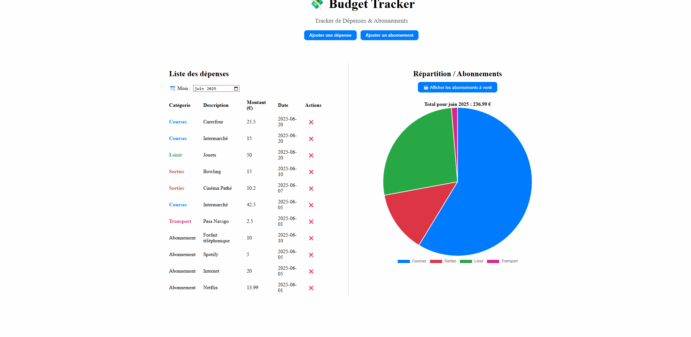

# 💸 Budget Tracker – Abonnements & Dépenses

Une application web de gestion de budget permettant de suivre ses **dépenses** et **abonnements récurrents** à l’aide d’un **calendrier interactif**, de **graphiques de répartition (camembert)** et de **statistiques mensuelles**.

---

## Fonctionnalités

- Répartition des dépenses mensuelles sous forme de **graphique (camembert)**, en se basant sur les catégories
- Suivi des **abonnements hebdomadaires/mensuels/annuels** (Netflix, Spotify, etc.), via un **calendrier** avec les prochains prélèvement à venir
- Gestion, c'est-à-dire ajout/suppresions, des **dépenses ponctuelles** ou **abonnements**
- Affichage du **total mensuel**

---

## Technologies utilisées

### Frontend
- [Angular](https://angular.io/) – Framework web
- [Chart.js](https://www.chartjs.org/) – Visualisation des données (camembert)
- HTML, CSS, TypeScript

### Backend
- [Spring Boot](https://spring.io/projects/spring-boot) – API REST
- [Spring Data JPA](https://spring.io/projects/spring-data-jpa) – Accès base de données
- Java

### Base de données
- [MySQL](https://www.mysql.com/) – Stockage des abonnements et dépenses sur 2 tables

---

## Aperçu



---

## 🚀 Installation

### 🔧 Backend – Spring Boot

1. **Se positionner dans le dossier backend** :
   ```bash
   cd backend
   ```

2. **Lancer le projet** :
   ```bash
   mvn spring-boot:run
   ```

3. Le backend est accessible à l'adresse :
   ```
   http://localhost:8080
   ```

4. **Configuration de la base de données** :  
   Dans le fichier `src/main/resources/application.properties`, configure les identifiants MySQL :
   ```properties
   spring.datasource.url=jdbc:mysql://localhost:3306/budget_tracker
   spring.datasource.username=ton_utilisateur
   spring.datasource.password=ton_mot_de_passe

   spring.jpa.hibernate.ddl-auto=update
   spring.jpa.show-sql=true
   ```

---

### 💻 Frontend – Angular

1. **Se positionner dans le dossier frontend** :
   ```bash
   cd frontend
   ```

2. **Installer les dépendances** :
   ```bash
   npm install
   ```

3. **Lancer l’application Angular** :
   ```bash
   ng serve
   ```

4. L’interface est disponible sur :
   ```
   http://localhost:4200
   ```

---
